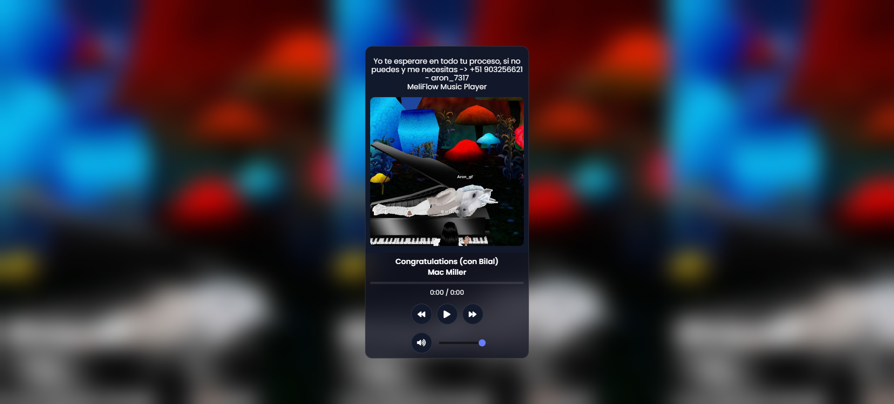

# Music Player 🎵

Este es un reproductor de música interactivo que permite reproducir canciones, controlar el volumen, navegar entre canciones y gestionar una lista de reproducción. El proyecto incluye un diseño atractivo y utiliza HTML, CSS y JavaScript para su funcionamiento.

## 🚀 Características

- **Reproducción de canciones:** Puedes reproducir, pausar y cambiar entre canciones.
- **Control de volumen:** Ajusta el volumen con un control deslizante.
- **Progreso de la canción:** Visualiza el progreso de la canción actual en una barra.
- **Lista de reproducción:** Explora una lista de canciones y selecciona la que desees reproducir.
- **Gestión visual:** Muestra el título de la canción, el artista y la portada del álbum.

## 📂 Estructura del proyecto

├── index.html # Archivo principal HTML
├── scripts/
│ └── index.js # Lógica de JavaScript para el reproductor
├── pages/
│ └── index.css # Estilos CSS
├── songs/ # Carpeta que contiene las canciones
│ ├── song1.mp3
│ ├── song2.mp3
│ └── ...
├── images/ # Carpeta de imágenes para las portadas
│ ├── album1.jpg
│ ├── album2.jpg
│ └── ...
└── README.md # Este archivo

🛠️ Instalación y configuración

    Clonar el repositorio:

    git clone https://github.com/zinderellasnuff/web_project_playlist.git
    cd tu-repositorio

    Estructura de archivos: Asegúrate de incluir canciones en la carpeta songs/ y portadas en la carpeta images/.

    Abrir el proyecto: Abre el archivo index.html en tu navegador.

🎮 Cómo usar

    Haz clic en el botón de reproducción para comenzar a escuchar.
    Usa los botones de adelantar y retroceder para navegar entre las canciones.
    Ajusta el volumen con el control deslizante.
    Abre la lista de reproducción para elegir una canción específica.

📸 Demo del Proyecto

Puedes ver el proyecto en acción visitando este enlace: [web_project_homeland](https://zinderellasnuff.github.io/web_project_playlist/)

